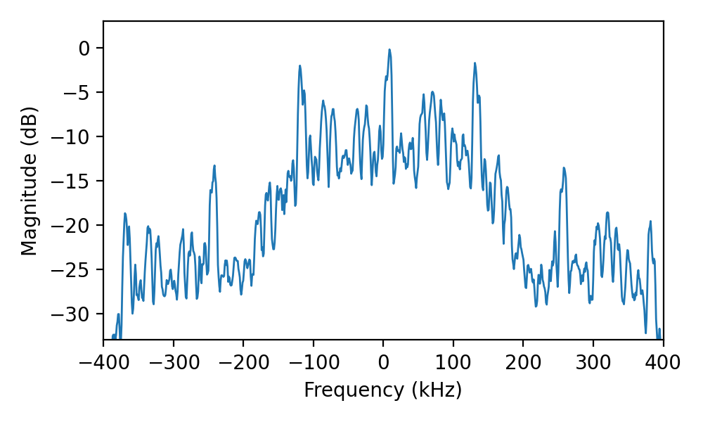
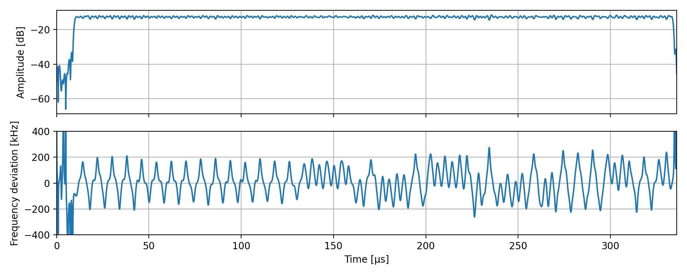
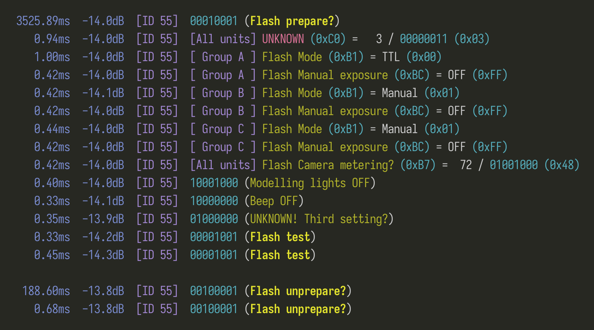

# GODOX Flash radio interface

This is an attempt at documenting the radio interface used by GODOX flash triggers to wirelessly control flash units (communicate settings and trigger them). The reader is assumed to have user-level familiarity with the GODOX flash system; we found the user manual for remote triggers to be useful in clarifying some concepts.

In addition to documentation, a basic receiver is included, see [tooling](#tooling).

Issues and PRs welcome! Question marks (?) indicate guesses we're not sure about.

# Layer 1

Judging by the spectrum, transmission bursts are some sort of FSK:



FM demodulating a burst gives us a (bipolar) [return-to-zero] signal, where each binary symbol is interspersed with a zero symbol:



The bits are sent at 250kbps (which gives 500k symbols per second if we count the zeros). Frequency deviation appears to be around 200kHz. However **the polarity is inverted**, negative deviation means 1 and positive deviation means 0.

TODO: document channel frequencies. For now we know that channel 8 uses a center frequency of **2424.5 MHz**.

# Layer 2

Frames have the following outer structure, using the above one as example:

| Preamble (32 bit) | ID (16 bit) | ID (repeated) | Type (8 bit) | Payload | Last bit |
| -------- | -------- | ------------------- | ---- | ------- | -------- |
| 10101010101010101010101010101010 | 0000001101111101 | 0000001101111101 | 11010101 | 00001010 | 0 |

 - **Preamble**: `10` repeated 16 times.
 - **ID**: Wireless ID, a number allowing for separate flash networks. See below for encoding.
 - **ID (repeated)**: Always an exact copy of the previous field. Not sure if it's sent twice for redundancy or source / destination or...
 - **Type / flags**: `11010101` for short payloads (8 bit) or `10101001` for long payloads (24 bit).
 - **Payload**: Fixed size depending on type, see below for contents.
 - **Last bit**: just a copy of the preceding bit, I guess to avoid artifacts near the end of the burst.

Throughout the descriptions below, big endian is used when interpreting fields as integers.

## ID encoding

The wireless ID a value in the range 0 to 99 that the user must configure in all triggers and flashes (actually the UI shows value 0 as "OFF", i.e. the value to set if some of the units do not allow setting the ID).

An... interesting encoding is used for the ID, where the integer to transmit in the 16-bit field is obtained through $\left\lfloor \frac{50024}{\text{id} + 1} \right\rfloor$ (in Python: `50024 // (id+1)`). Here's a few examples:

- Setting ID to 0 (OFF) transmits 50024 (`1100001101101000`).
- Setting ID to 1 transmits 25012 (`0110000110110100`).
- Setting ID to 37 transmits 1352 (`0000010101001000`).
- Setting ID to 99 transmits 500 (`0000000111110100`).

## Long payloads

These can be addressed to either all flashes, or to a specific receiver group (A, B, C, D, E). They are mostly used to set properties on flashes. Structure of an example payload:

| Receiver group (8 bit) | Property ID (8 bit) | Value (8 bit) |
| ---------------------- | ------------------- | ------------- |
| 00001011               | 10110001            | 00000001      |
| group B                | Flash mode          | Manual        |

The receiver group can take the following values:
  - **`0x50`** (`01010000`): Addressed to all receivers.
  - **`0x0A` to `0x0E`** (`00001XXX`): Addressed to a specific receiver group.

The following properties have been observed so far. The "target receivers" column lists the values of the receiver group field we've observed so far on each property.

| Property ID | Name | Target receivers | Description |
| ----------- | ---- | ---------------- | ----------- |
| **0xBX** | **Flash properties** | | | |
| 0xB1 | Mode | all, specific | <table><thead><tr><td>Value</td><td>Meaning</td></tr></thead><tbody> <tr><td>0</td><td>TTL</td></tr> <tr><td>1</td><td>Manual or OFF</td></tr> <tr><td>2</td><td>Strobe</td></tr> </tbody></table> |
| 0xB2 | Zoom level | all | (as shown in trigger menu) (TODO: example) |
| 0xB3 | High speed sync | all | <table><thead><tr><td>Value</td><td>Meaning</td></tr></thead><tbody> <tr><td>0</td><td>Disabled</td></tr> <tr><td>1</td><td>Enabled</td></tr> </tbody></table> |
| 0xB4 | Trigger mode? | all | Always sent 2x with value 2 when shooting with the camera, immediately after transmitting the rest of the settings. Not sent when pressing TEST. |
| 0xB7 | Camera metering? | all | Sent at constant but irregular intervals (0.1 - 2s) when the camera is in a specific mode, to transmit some kind of feedback. Usual value is 0x48 (72) but we sometimes got it to transmit smaller values like 0x28 (40). The way values often vary makes it sometimes feel like it's a bitfield? |
| 0xB9 | TTL exposure | specific | Serves the same purpose (and carries the same values as) 0xBC, but when mode is TTL rather than manual. Set individually for each flash when shooting (presumably with the per-flash exposure compensation applied). 0xFF disables the flash for the shot. Not set in other modes. |
| 0xBC | Manual exposure | specific | <p>Transmitted value is in tenths of a stop, negated. For example:</p> <table><thead><tr><td>Value</td><td>Meaning</td></tr></thead><tbody> <tr><td>0</td><td>0 stops (1/1)</td></tr> <tr><td>30</td><td>-3.0 stops (1/8)</td></tr> <tr><td>58</td><td>-5.8 stops (1/64 +0.2)</td></tr> </tbody></table> <p>This property is always set to 0xFF when in TTL mode, and not set at all when in strobe mode. When in manual mode, 0xFF puts the flash in standby.</p> |
| 0xBD | Strobe exposure | specific | Serves the same purpose (and carries the same values as) 0xBC, but when mode is strobe rather than manual. 0xFF disables the flash. Not set in other modes. |
| 0xBE | Strobe count | all | Amount of flash firings when triggered in strobe mode. Not set for other modes. |
| 0xBF | Strobe frequency | all | Spacing between flash firings when triggered in strobe mode, with the value in units of Hertz. Not set for other modes. |
| 0xC0 | | all | Unknown? But always set to value 3, both when testing and shooting, and before any other setting |
| **0xDX** | **Modelling light properties** | | |
| 0xD1 | Intensity | specific | Intensity of the modelling light, as a percentage (range [0, 100]). Only takes effect when 0xD6 is disabled.
| 0xD3 | Enabled | specific | <p>Whether the modelling light is turned on at all.</p> <table><thead><tr><td>Value</td><td>Meaning</td></tr></thead><tbody> <tr><td>0</td><td>Disabled</td></tr> <tr><td>1</td><td>Enabled</td></tr> </tbody></table> |
| 0xD6 | Proportional | specific | <p>Whether the modelling light should use proportional power.</p> <table><thead><tr><td>Value</td><td>Meaning</td></tr></thead><tbody> <tr><td>0</td><td>Disabled</td></tr> <tr><td>1</td><td>Enabled</td></tr> </tbody></table> |

## Short payloads

This seem to be addressed to all flashes. We haven't been able to determine much structure off them, so we're treating them as 8 bit bitstrings for now:

 - `00`... (these trigger actions)

    - `011010`: **Camera shutter prepare?**: unsure what this does, but it's sent once when shooting with the camera, 20ms after setting the properties but 25ms before actually triggering the flashes (see next command).

    - `011001`: **Camera shutter flash**: triggers the flashes; sent 2x when shooting with the camera

    - `010001`: **Flash prepare?**: don't know what it does, but it's sent once in the following situations:
      - when pressing TEST, as the very first frame
      - when releasing SHUTTER, as the only frame

      (recall that the TEST and SHUTTER buttons are different "depth levels" of the same physical button of the trigger, so one needs to press TEST before they can press SHUTTER)

    - `001001`: **Flash test**: triggers the flashes; sent 2x when pressing the TEST button as the very last frame

    - `001010`: **Shutter?**: don't know what it does, but it's sent 2x when pressing the SHUTTER button

    - `100001`: **Flash unprepare?**: don't know what it does, but it's sent in the following situations:
      - 2x when releasing the TEST button
      - 1x when shooting with the camera, 20ms after triggering the flashes

 - `10`... (these set a property)
    - `00000X`: **Set beeper** OFF (X = 0) or ON (X = 1)
    - `00100X`: **Set modelling lights** OFF (X = 0) or ON (X = 1)

 - `01000000`: unsure what this does, but it's sent together with the other properties, suggesting this is also about setting a property

# Tooling

## Receiver

A basic receiver is included. It's composed of:

 - A basic GNU Radio Companion pipeline, whose only purpose is fetching I/Q samples from the SDR, extract the 1MHz channel from it, and make it available on TCP port 20000.

 - A Python CLI tool that streams from the port, selects bursts over a certain threshold, tries to decode and parse them, and logs them to the console. The only dependency is Numpy.

Here's an example of the receiver's output when the TEST button is pressed and then released:



Each message is printed as a single line, prefixed with the gap since it and the last (successfully decoded) burst, as well as the median power level for the burst. It's meant to be for reverse-engineering, not for final users, so manage your expectations when it comes to code quality or robustness (especially if you have substantial interference from other appliances on the channel).

To use it:

 - Install Python, GNU Radio, gr-osmosdr and Numpy. The easiest way to do this is with a distribution such as [Radioconda][].

 - Open the provided `basic.grc` pipeline in GNU Radio Companion. This pipeline is designed for [HackRF][] SDRs, and will need some adapting if you wish to use it with other SDRs, like RTL-SDR.

 - By default the pipeline listens on a center frequency of 2424.5 MHz, which corresponds to channel 8. Either ensure your units are set to this channel, or change the frequency by tweaking the variable `center_freq`.

 - Run the pipeline by clicking on the Play button.

 - With the pipeline running, start the Python receiver: `python3 receiver.py`. Since it uses the power level to distinguish bursts, you might need to increase the threshold (if a lot of non-bursts are getting detected and attempting to be decoded, which will result in a looot of errors) or decrease it (if nothing is being detected). To do this, tweak the `threshold_db` variable in the script, which is set to -30dB by default.

## Transmitter

A proof-of-concept transmitter Python module is included in `transmitter.py` which writes RF bursts to stdout. The physical layer still needs a bit of tuning, because frames are often lost and some frames just never work. Only depends on `numpy` and outputs 2MHz-sampled bursts in HackRF format (8-bit signed integer I/Q). You can feed its output to `hackrf_transfer` to transmit the burst through a HackRF radio:

```bash
python -c 'from transmitter import *; Command(55).short_command(ShortCommand.FLASH_TEST)' | hackrf_transfer -t- -s2000000 -f2424500000
```

The above will do a flash test to network 55 on channel 8. See the API for other commands.


[return-to-zero]: https://en.wikipedia.org/wiki/Return-to-zero
[radioconda]: https://github.com/radioconda/radioconda-installer
[HackRF]: https://greatscottgadgets.com/hackrf
